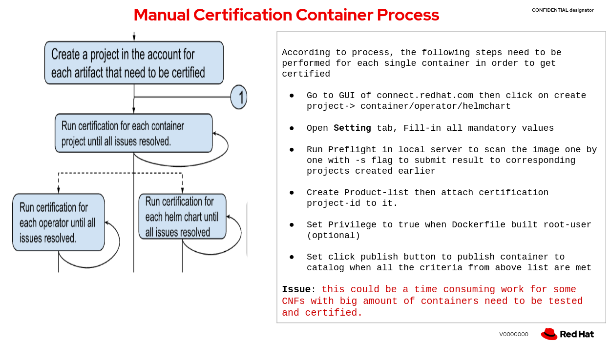

# Automate certification process by utilizing DCI to interact with the catalog backend
This repository demonstrates how to automate the certification of container projects for CNFs. This includes recertifying container images, as well as fully automating the end-to-end process of creating, updating, attaching, and publishing container projects for multiple images at once.

## Summary: 
The objective of this repository is to demonstrate how to improve the container certification process by leveraging the new features of DCI. The process involves creating container projects, updating mandatory parameters, testing and scanning container images, attaching a product listing, and automating the publishing of container projects once all criteria are satisfied.

Second part is to illustrate the process of recertifying container projects that already exist in the catalog when a new software release is available. This involves updating the version of the container, including its digest and tag, and republishing it to the catalog.

## Manual Certification Container Process



## Automation Container Certification Flow


## Auto Publish Preparations

- OCP and DCI ENV (included dcirc.sh,install.yml etc..)  
Any OCP Cluster and a helper node with DCI RPM packages installed
 
- **Settings.yml**  
A Settings with DCI auto-publish enhancement feature
 
- **Auth.json**    
Docker Authentication to access container repo on private registry server
 
- **Pyxis-apikey.txt**    
A token to access specific partner Pyxis catalog data using REST API
 
- **Kubeconfig**    
A kubeconfig that can access the OCP cluster
 
- **Product-listing ID**    
Before a container or helm chart/operator can be publicly listed into RedHat catalog, a Product-Listing must be created, it only need to create once according to CNF type
 
- **Organization ID**    
Mandatory when using create_container_project. Company ID will be used for the verification of container certification project Organization-ID Company-Profile

## Auto Publish Settings Configuration
```yaml
---
dci_topic: OCP-4.11
dci_name: Testing DCI to create certification Project Automatic and Update mandatory settings and publish
dci_configuration: Using DCI create project,update,submit result and auto-publish
preflight_test_certified_image: true
dci_config_dirs: [/etc/dci-openshift-agent]
partner_creds: "/var/lib/dci-openshift-app-agent/demo-auth.json"
organization_id: 15451045
preflight_containers_to_certify:
  - container_image: "quay.io/avu0/auto-publish-ubi8-nginx-demo1:v120"
    create_container_project: true
    short_description: "I am doing a full-automation e2e auto-publish for following image auto-publish-ubi8-nginx-demo1:v120"
    attach_product_listing: true

  - container_image: "quay.io/avu0/auto-publish-ubi8-nginx-demo2:v120"
    create_container_project: true
    short_description: "I am doing a full-automation e2e auto-publish for following image auto-publish-ubi8-nginx-demo2:v120"
    attach_product_listing: true
cert_settings:
   auto_publish: true
   build_categories: "Standalone image"
   registry_override_instruct: "<p>This is an instruction how to get the image link.</p>"
   email_address: "whoami@redhat.com"
   application_categories: "Networking"
   os_content_type: "Red Hat Universal Base Image (UBI)"
   privileged: false
   release_category: "Generally Available"
   repository_description: "This is a test for Demo how to automate to create project, SCAN and update settings"

cert_listings:
  published: true
  type: "container stack"
  pyxis_product_list_identifier: "642a2aff90de6580a53c2f66"  # product list id for container projects

pyxis_apikey_path: "/var/lib/dci-openshift-app-agent/demo-pyxis-apikey.txt"
dci_gits_to_components: []
...
```
